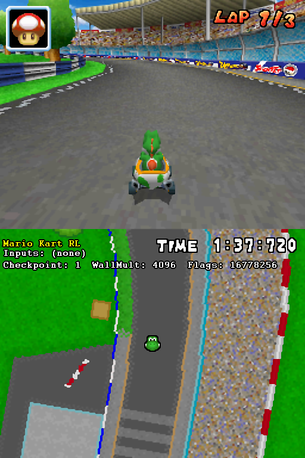

# Mario Kart RL

## Setup

+ Place the repo’s contents into a folder inside **BizHawk/Lua** **(BizHawk/Lua/Repo)**
+ Then start the [start.bat](https://github.com/OBNinjaa/mario-kart-rl/blob/main/start.bat) script.
+ The emulator should then start. Then load your mario kart rom (.nds) and load a track.
+ Then go to **Tools** > **LUA Console** then in the new window that pops up **Script** > **Open Script** then load [main.lua](https://github.com/OBNinjaa/mario-kart-rl/blob/main/main.lua) which should be where you stored this repo **(BizHawk/Lua/Repo)**
+ You should then see a GUI appear on your emulator screen.

